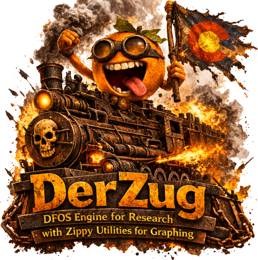

::: {.callout-warning}
## Experimental Software

DerZug is an early-stage proof of concept.
Expect bugs, incomplete behavior, data-loss risks, and frequent breaking changes.
The creators make no promises of further development or maintenance.
:::



DerZug is powered by the [Orange3](https://orangedatamining.com/),
[PyQtGraph](https://www.pyqtgraph.org/), and [DASDAE](https://dasdae.org) ecosystems.

Its goal is to allow users to **interactively create, debug, and share reproducible DFOS workflows**.

It can be launched as a standalone application, or used for interactive exploration in code.

## Installation

```bash
pip install derzug
```

::: {.callout-tip}
DerZug can be installed on any of the listed Python versions, but Qt-related issues are still possible.
The smoothest experience is generally on Python 3.13. It may help to first create a mamba/conda environment
with Orange3 installed, then install DerZug into that.
:::

## Basic Usage

Launch the full application from the command line:

```bash
derzug
```

Or use interactively in code:

```python
import dascore as dc

patch = dc.get_example_patch("example_event_2")

# Launches a waterfall window for viewing a patch
patch.zug.waterfall()
```
